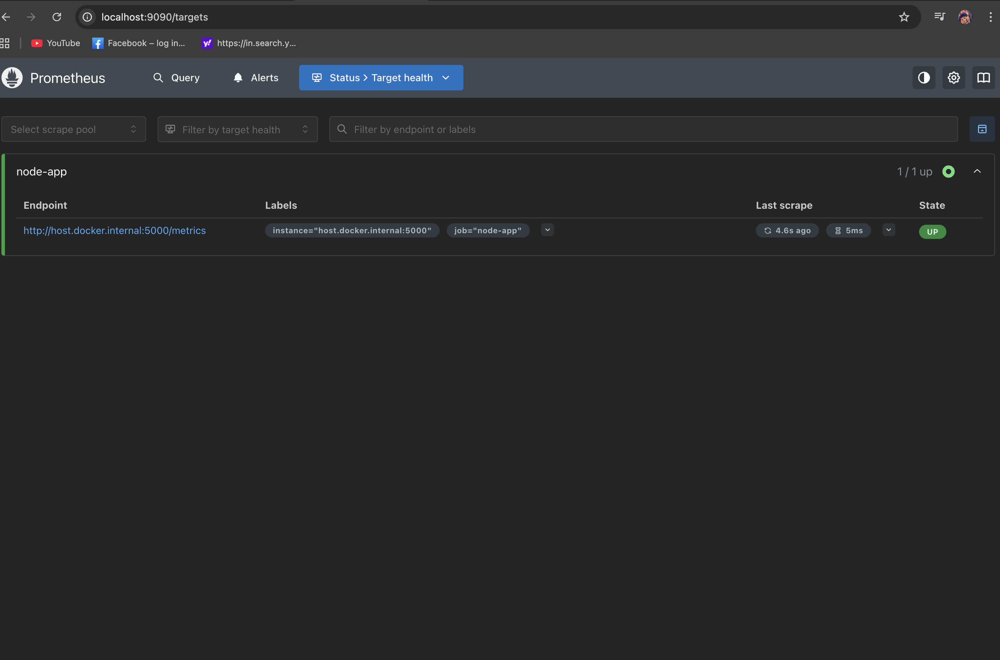
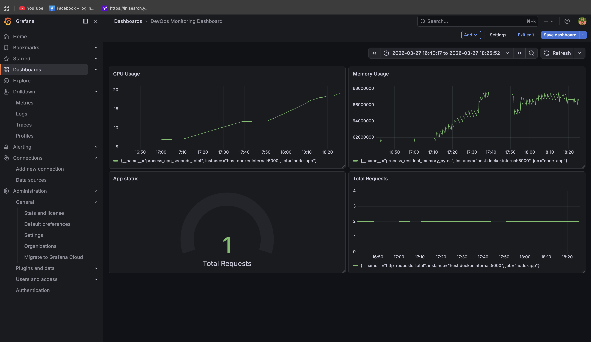
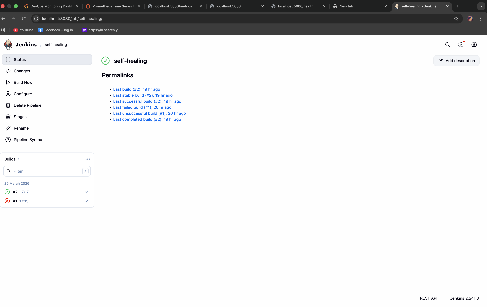
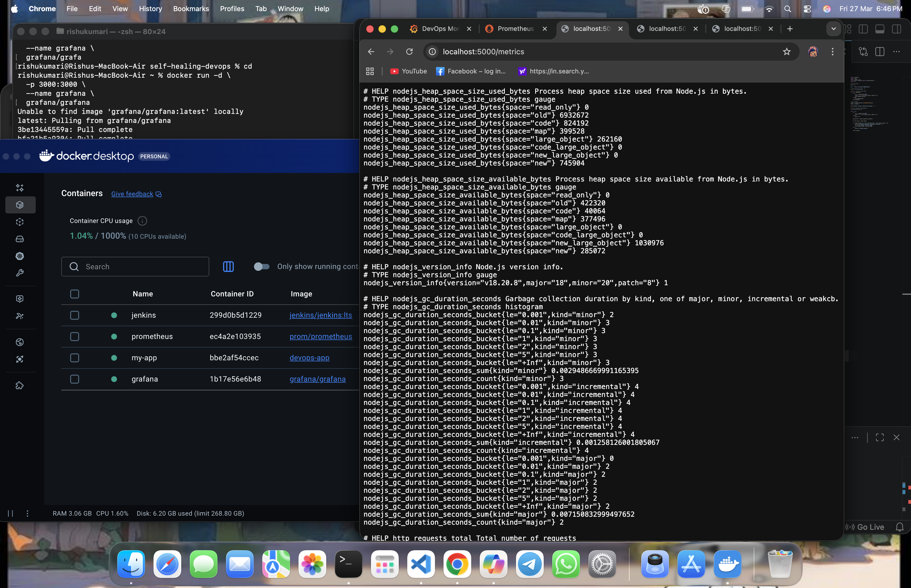
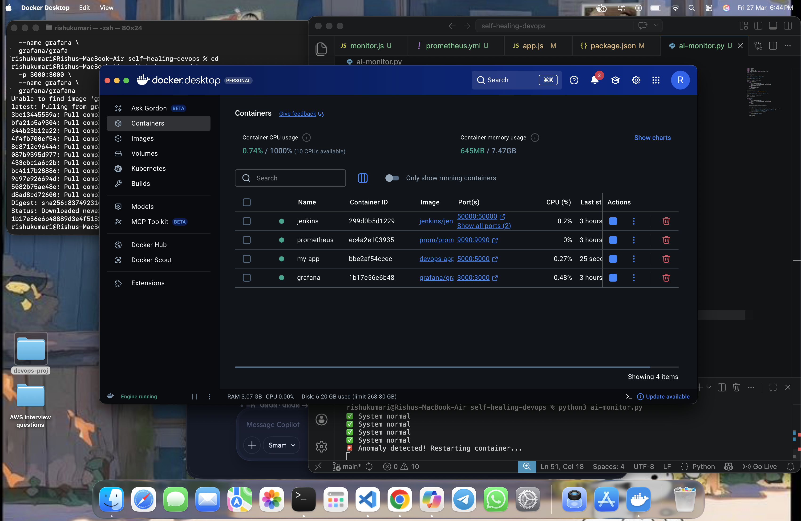
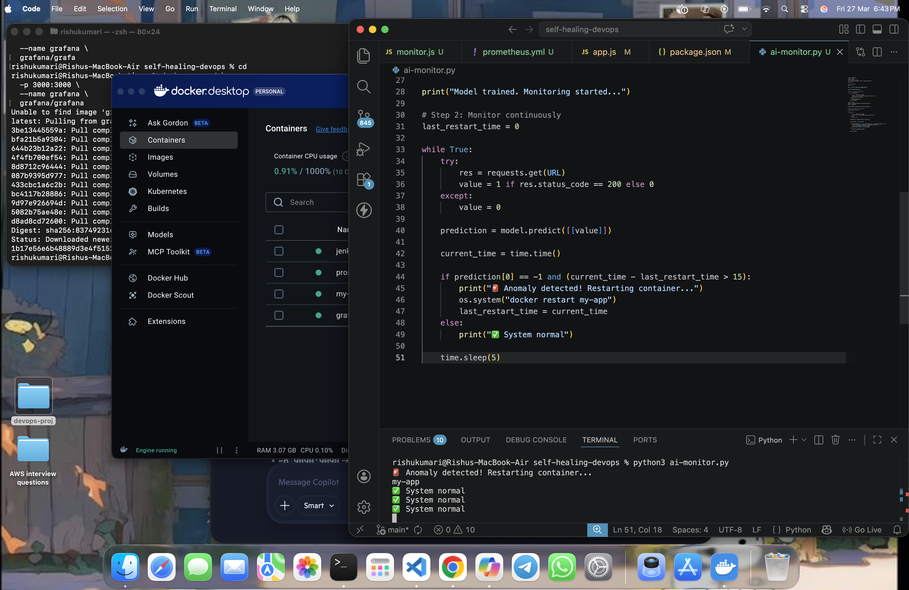

# AI-Driven Self-Healing DevOps Pipeline

> A 0-cost project that grew into a working self-healing pipeline with CI, monitoring, dashboards, and machine learning.

## 👋 Getting to know the project

Hi! I’m Risu. I built this project to move from theory to hands-on practice. This repo is a lab where I combine:

- a simple Node.js app that simulates random failures
- Prometheus scraping metrics
- Grafana dashboards to visualize health
- Jenkins pipeline concepts for CI/CD
- a watchdog (`monitor.js`) for quick recovery
- an Isolation Forest-based monitor (`ai-monitor.py`) for anomaly-driven healing

**Goal:** ship software that detects and fixes itself, so ops teams can move faster with fewer interrupts.

## 🧩 What’s inside (explained casually)

- `app.js`: tiny Express app with `/`, `/health`, `/metrics`. It returns `500` randomly to simulate flakiness.
- `monitor.js`: simple Node.js loop. If `/health` fails, `docker restart my-app`.
- `ai-monitor.py`: trains an `IsolationForest` from live health responses, then restarts on anomalies.
- `prometheus.yml`: scraping all the expected endpoints.
- `Dockerfile`: containerizes the Node.js service.

## ⚙️ Why this is cool

1. It actually breaks sometimes, so we can test resilience
2. It recovers automatically in both rule-based and ML-based modes
3. It is easy-to-clone, run, and iterate on
4. It is already aligned with the “shift-left reliability” mindset

## 🚀 Run it locally (in 7 steps)

1. Clone and go in:

```bash
git clone https://github.com/rishu-1112/self-healing-devops.git
cd self-healing-devops
```

2. Install Node dependencies:

```bash
npm install
```

3. Build and start the app in Docker:

```bash
docker build -t my-app .
docker run -d --name my-app -p 5000:5000 my-app
```

4. Start Prometheus:

```bash
docker run -d --name prom -p 9090:9090 -v "$PWD/prometheus.yml:/etc/prometheus/prometheus.yml" prom/prometheus
```

5. Start Grafana:

```bash
docker run -d --name grafana -p 3000:3000 grafana/grafana
```

6. In one terminal run:

- rule-based watcher: `node monitor.js`
- AI-based watcher: `python3 ai-monitor.py`

7. Check the app:

```bash
curl -i http://localhost:5000/health
curl -i http://localhost:5000/metrics
```

## 📊 What to explore in Prometheus + Grafana

- Prometheus UI: `http://localhost:9090`
- Grafana UI: `http://localhost:3000`
- Add dashboard for `http_requests_total`, `process_cpu_user_seconds_total`, etc.
- Use Grafana alerting later with Prometheus Alertmanager.

### Screenshots (ready-to-use)








## 🤖 AI behavior in `ai-monitor.py`

- Warm-up: collect ~20 samples from `/health` (OK=1, FAIL=0)
- Train `IsolationForest(contamination=0.2)` from this profile
- Loop every 5 sec: ping health, run `predict`, if anomaly -> `docker restart my-app`
- Cooldown 15 sec between restarts to avoid thrash

## 🌱 What I want to add next

- Kubernetes support (Deployments + HPA)
- Central logs (ELK / Loki)
- Slack/email alerts on incidents
- Better anomaly models (LSTM sequence model, autoencoders)
- GitOps pipeline with Jenkinsfile + branch gating

## 🛠️ Quick commands to play with

```bash
node monitor.js
python3 ai-monitor.py
curl -i http://localhost:5000/health
curl -i http://localhost:5000/metrics
```

## 📦 Prerequisites

- Node.js 18+
- Python 3.9+
- pip packages: `requests numpy scikit-learn`
- Docker installed and running
- (Optional) Jenkins + Prometheus + Grafana

```
pip install requests numpy scikit-learn
```

## 💬 The human side

This started as a challenge: “Can I make a full self-healing pipeline for ₹0?”

Answer: yes—and it was a great learning project. If you’re reading this, I’d love your feedback, your ideas, and your collaboration.

---

## 👩‍💻 About me

I’m Risu Kumari (B.Tech CSE 2023–2027, Sarala Birla University). I love shipping real systems in DevOps, cloud, and AI.

- GitHub: https://github.com/rishu-1112

---

## 🤝 Let’s connect

Open to mentorship requests, collaboration, and early-stage product hackathons.

